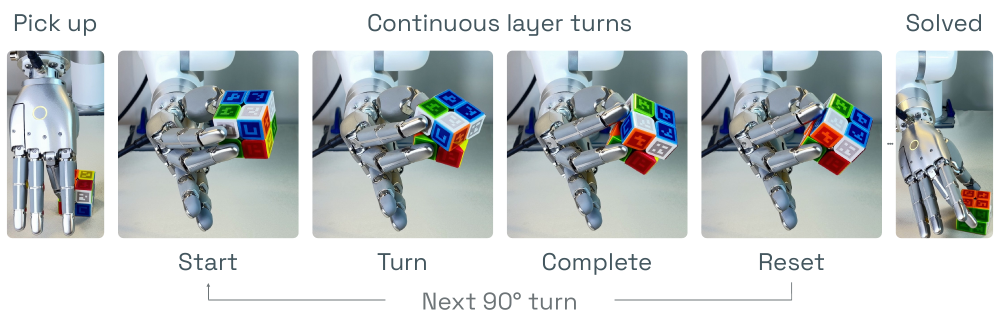

<div align="center">

# FINGR: Learning Dexterous Hand Control<br>for Real-World Rubik's Cube Solving

[Yutong Liang](https://www.lyt0112.com/)<sup>1,\*</sup> · [Quanquan Peng](https://pengqq.com/)<sup>1,\*</sup> · [Matthew Kim](https://mattkiim.github.io/)<sup>1,\*</sup> · [Xiaolong Wang](https://xiaolonw.github.io/)<sup>1</sup>

<sup>1</sup>UC San Diego · <sup>\*</sup>Equal contribution

[](https://www.lyt0112.com/projects/FINGR) [](https://youtu.be/0rlplkw3sxQ) [](https://huggingface.co/datasets/EmptyBlue/FINGR) [](https://www.lyt0112.com/projects/FINGR#visualization)

</div>



Tested on Ubuntu 22.04 with Python 3.12, PyTorch 2.7.1 (CUDA 11.8), an Intel i9-13900K, 32 GB RAM, and one NVIDIA RTX 4090 (24 GB). Training for 1,000 epochs takes about 1 hour.

Clone the repository and enter its directory.

```bash
git clone https://github.com/EmptyBlueBox/FINGR.git
cd FINGR
```

Visualize a training trajectory, downloading the dataset automatically on first use.

```bash
uv run -m fingr.visualize_training_traj
```

Train the FINGR policy on the demonstration dataset.

```bash
uv run -m fingr.train_policy
```
